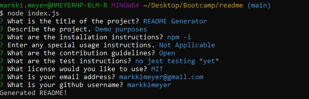

# README Generator

 

  ## Description

  This application prompts a user for criteria and uses the reponses to generate a README md file. 

  ## Table of Contents
  
  - [Installation](#installation)
  - [Usage](#usage)
  - [Demo](#Demo)
  - [License](#license)
  

  ## Installation
  To download dependencices and modules: npm i

  ## Usage
  From the command line of the terminal, type "node index.js" to run the app. Answer the prompts, which include the title, description, installation, testing, usage, license, and contact information. 

  

  ## Demo
  Demo video is published on YouTube [here](https://youtu.be/2FI_x8P0UrE).

  ## License
  MIT

 [Back to Table of Contents](#table-of-contents)
